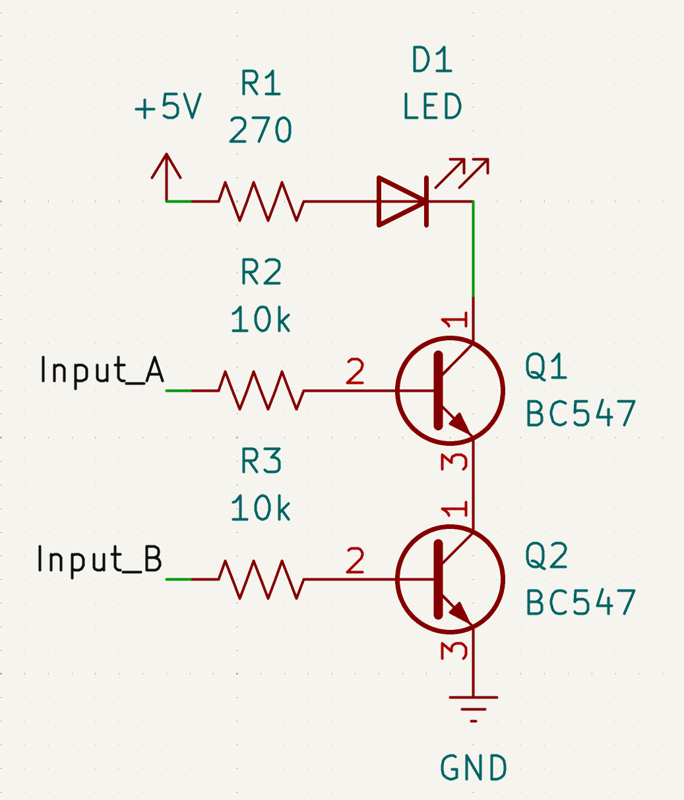
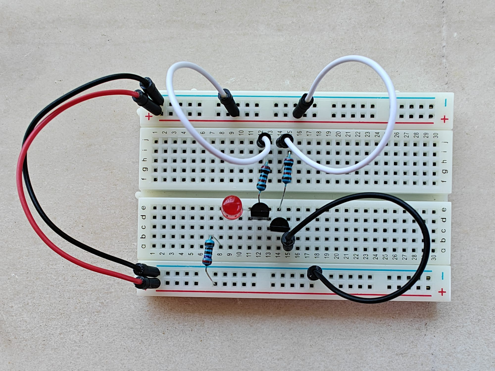

# AND gate with two inputs

<table align="center" border="0" cellpadding="8">
  <!-- Row 1: The Images (Centred Vertically) -->
  <tr valign="middle">
    <td align="center" width="50%">
      
    </td>
    <td align="center" width="50%">
      
    </td>
  </tr>
  <!-- Row 2: The Captions (Locked in Horizontal Alignment) -->
  <tr valign="top">
    <td align="center">
      <b>Figure 1:</b> AND Gate Schematic
    </td>
    <td align="center">
      <b>Figure 2:</b> AND Gate Circuit
    </td>
  </tr>
</table>

---

## 1. Circuit Description

This circuit is an implementation of an AND gate using two NPN transistors in series. Current comes from the +5V rail through the 270Ω current-limiting resistor and the red LED, but gets blocked from reaching GND by those two series-connected transistors. For the LED to light up, we would need both transistors to act as closed switches. For that to happen, we would need both `Input_A` and `Input_B` to receive 5V so the transistors' bases would saturate and complete the circuit. But, if either `Input_A` or `Input_B` were connected to GND, that specific transistor would act as an open switch, creating an incomplete circuit and keeping the LED dark.

---

## 2. Truth Table
The table below shows the logic values of the circuit relative to each input's state.

| Case | Input A | Input B | Output (LED) |
| :---: | :---: | :---: | :---: |
| **Case 1** | 0 (GND) | 0 (GND) | 0 (LOW) |
| **Case 2** | 0 (GND) | 1 (+5V) | 0 (LOW) |
| **Case 3** | 1 (+5V) | 0 (GND) | 0 (LOW) |
| **Case 4** | 1 (+5V) | 1 (+5V) | 1 (HIGH) |

---

**Logic 0 (LOW):**
* **Case 1:** `Input_A` is connected to GND (0) and `Input_B` is connected to GND (0).
* **Case 2:** `Input_A` is connected to GND (0) and `Input_B` is connected to +5V (1).
* **Case 3:** `Input_A` is connected to +5V (1) and `Input_B` is connected to GND (0).

**Logic 1 (HIGH):** 
* **Case 4:** `Input_A` is connected to +5V (1) and `Input_B` is connected to +5V (1).
